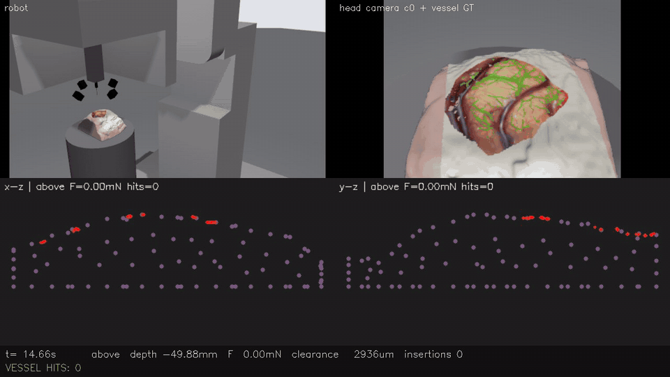

# Neuralink-style surgical robot simulator

A cluster-deployable simulator for a Neuralink R1-style thread-insertion robot: an engineer submits a robot controller,
the system runs it against a pulsating, deformable brain with real vasculature, and reports — live and afterwards — what
the needle touched, punctured and which vessels it hit. **Live vessel detail is published as ROS2 topics, so a controller
can plan insertion sites around the vasculature** (`/brain/vessels`, `/cam/<cam>/vessel_mask`, `/brain/needle_state`).



*Dashboard, 5 fps (naive grid controller, 9 insertions, one vessel hit → red frame): robot overview · head-hub camera
with vessel ground truth · two orthogonal SOFA tissue cross-sections through the needle · status bar.*

> Not affiliated with Neuralink. The robot geometry and workflow were reconstructed from **public sources only**:
> Neuralink's YouTube videos and launch events, and the 2019 JMIR white paper (Musk & Neuralink, PMC6914248).

## What it does
- **Robot**: 5-axis arm + head-internal XY stage + TwinZ needle drive (7 joints), modelled in Fusion 360 → URDF,
  simulated in **Gazebo Harmonic**, controlled over **ROS2 Jazzy**. Four RGB cameras in the head hub + an overview camera.
- **Brain**: textured cortex + skull with a craniotomy (phantom assets from
  [D3MIA/SOFA-NeuroSim-Recorder](https://github.com/D3MIA/SOFA-NeuroSim-Recorder), fetched at build time).
  Real-time **SOFA** FEM of the tissue under the craniotomy: cardiac + respiratory pulsation, dimpling under the needle,
  puncture threshold. ~11.8k vessel centreline points (980 segments) extracted from the cortex texture ride on the FEM.
- **Ground truth**: needle state (above / contact / inserted, depth, force, nearest-vessel clearance), vessel hits,
  per-camera vessel masks pixel-aligned with the RGB images, vessel point cloud — all live ROS2 topics, all recorded
  (see [docs/TOPICS.md](docs/TOPICS.md)).
- **Service**: one container image; one command submits a controller to any GPU node (H100 / A40 / V100), isolates
  concurrent users, and returns `metrics.json` (pass/fail), `dashboard.mp4` and a rosbag.

## Quick start (on the cluster)
```bash
N=service/neuro
$N run service/examples/ctrl_vessel_aware.py service/scenarios/default.yaml   # batch: controller -> report + video
$N report <run_dir>                                                            # pass/fail + per-insertion table
$N session                                                                     # live simulation (1 h)
$N watch <run_dir>      # live dashboard      $N teleop <run_dir>   # keyboard control
$N exec <run_dir> my_controller.py             # drive a live session from another node
```

## Vessel topics for planning
| topic | content |
|---|---|
| `/brain/vessels` | PointCloud2, 10 Hz: vessel centrelines `x,y,z,radius,id,burst` in world frame, moving with pulsation + FEM deformation |
| `/cam/<c0..c3>/vessel_mask` | mono8, 10 Hz: vessel GT pixel-aligned with `/cam/<cam>/image` |
| `/brain/vessel_map` | rgb8, 10 Hz: top view of the craniotomy with vessels and the needle |
| `/brain/needle_state` | JSON, 50 Hz: tip, depth, state, nearest vessel id + clearance |
| `/brain/vessel_burst` | JSON event: vessel hit |

Full interface: [docs/TOPICS.md](docs/TOPICS.md).

## Writing a controller
```python
from neuro_sdk import Robot
rb = Robot()                        # connects to the simulation
V = rb.vessels()                    # live vessel centrelines: x, y, z, radius, id (world frame, m)
rb.move_tip(0.002, -0.004)          # needle tip above (x, y), head hovering ~5 cm above the cortex
r = rb.insert(depth=0.004)          # TwinZ at the scenario speed -> {'punctured', 'depth_m', 'peak_force_n', 'hits'}
rb.retract()
```
A **scenario** (`service/scenarios/*.yaml`) sets the initial robot state, brain pulsation, puncture force, needle
speed and pass criteria. Examples: `ctrl_naive_grid.py` (ignores vessels → hits one, FAIL) and `ctrl_vessel_aware.py`
(plans sites with ≥ 400 µm clearance → 0 hits, PASS).

## Layout
| path | content |
|---|---|
| `robot_v1/` | Fusion 360 URDF + meshes |
| `gz_demo/` | Gazebo/ROS2 nodes: `sofa_brain_node.py` (real-time FEM), `brain_node.py` (analytic fallback), `dashboard_node.py`, `neuro_sdk.py`, `teleop_keys.py`, asset generators |
| `service/` | `neuro` CLI, job runner, report, example controllers, scenarios |
| `deploy/` | Apptainer image recipe, asset + image build scripts |
| `config.yaml` | units, brain material and pulsation parameters (with literature sources) |

## Build
```bash
deploy/build_assets.sh                  # robot model, levelled brain world, vessel GT, FEM block
sbatch deploy/build_image.sbatch        # -> neuro_sim.sif (ROS2 Jazzy + Gazebo Harmonic + SOFA v26.06 + code + assets)
```
Paths in the scripts are set for the Oregon State HPC cluster (`/nfs/hpc/...`); adjust `NEURO_SIF`, `NEURO_GZ`,
`NEURO_RUNS` for other sites.

## Parameters and sources
Brain tissue: corotational FEM, E = 3 kPa, ν = 0.45 (Bilger 2014). Pulsation: cardiac 100 µm p-p at 1 Hz
(Paulk et al. 2022), respiratory 500 µm p-p (Faria et al. 2014). Needle: 24 µm tip (JMIR 2019); insertion speed and
puncture force are scenario parameters.
